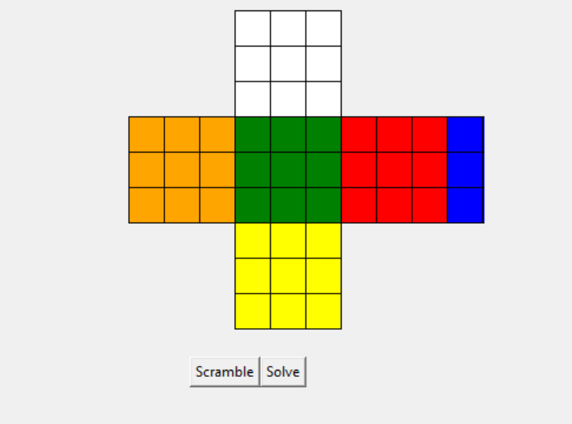
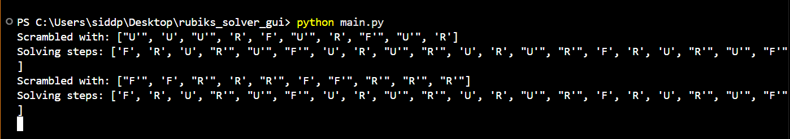

# Rubik's Cube Solver GUI

This project is a 3x3 Rubik’s Cube solver with a visual GUI built using Python and Tkinter.


*Rubik's Cube Visual Interface*


*Scramble Animation*

## Features
- Visual representation of a 3x3 cube
- Manual moves (R, U, F, etc.)
- Scramble button
- Solve button (layer-by-layer logic)

## Requirements
- Python 3.x
- Tkinter (comes pre-installed with Python)

## Run the App
```bash
python main.py
